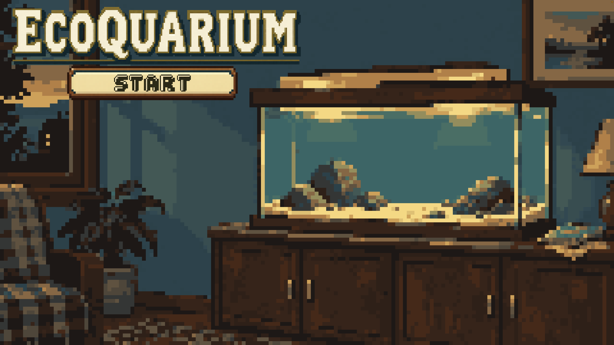
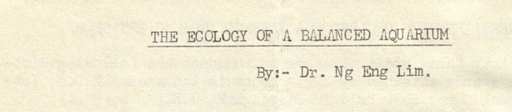
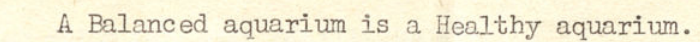

<div align="center">

# ECOQUARIUM

### Build beauty. Protect balance. Keep life flowing.

**Godot 4.7 · Pixel art · Aquarium simulation · Five-day game jam**



</div>

## A living system in miniature

Ecoquarium is a slow-paced aquarium management game about creating something beautiful without overwhelming the ecosystem that supports it. Add fish and plants, feed your aquarium, adjust its light, and watch oxygen, carbon dioxide, food, beauty, and money interact.

More fish can make the aquarium more attractive and increase visitor income, but every animal also consumes food and oxygen. Plants restore oxygen when given enough light and carbon dioxide. Growth is therefore not simply a matter of buying more: a thriving aquarium depends on restraint, observation, and balance.

## From the archive



The game is inspired by **“The Ecology of a Balanced Aquarium” by Dr. Ng Eng Lim**, published in the June 1972 issue of *The Aquarist: Bulletin of the Singapore Aquarists' Society* (Vol. 3, No. 4).

The bulletin captures a community deeply invested in fishkeeping. Alongside fish beauty competitions, members shared practical knowledge so that others could understand and enjoy the hobby. Dr. Ng's article approaches the aquarium not as decoration alone, but as a living cycle shaped by photosynthesis, respiration, light, stocking, and the careful selection of fish and plants.

<div align="center">



</div>

Ecoquarium turns those ideas into decisions the player can see and feel:

| From the article | In the game |
| --- | --- |
| Plants use light and carbon dioxide during photosynthesis | Plants consume CO2 and produce O2 according to the selected light level |
| Fish respire and depend on oxygen | Each species consumes O2 and produces CO2 over time |
| A tank can be overcrowded | Every fish adds beauty and income, but also increases pressure on the ecosystem |
| Fish, plants, and lighting must suit one another | Players choose species, place plants, and tune the light while watching live tank readings |

The simulation is intentionally approachable rather than scientifically exhaustive. Its purpose is to make the relationships described in the article tangible, and to offer a small taste of the patience and care behind the fishkeeping hobby.

## How to play

1. Select a fish or plant from the shop.
2. Left-click in the tank to place the selected fish, or on the substrate to place a plant.
3. Right-click in the water to disperse food.
4. Use the **-** and **+** controls to adjust the aquarium light.
5. Watch the O2, CO2, food, species health, money, and beauty displays.
6. Build gradually: beauty earns money, but an unbalanced tank puts its inhabitants at risk.

| Input | Action |
| --- | --- |
| Left click | Select and place fish or plants |
| Right click | Drop food at the cursor |
| **- / +** | Decrease or increase light intensity |
| Hover over a shop item | View its ecological statistics |

## Open and run the project

### Requirements

- [Godot Engine 4.7](https://godotengine.org/) (standard GDScript build)
- A graphics device or browser supporting Godot's **GL Compatibility** renderer

### Run in Godot

1. Clone or download this repository.
2. Open the Godot Project Manager and choose **Import**.
3. Select `project.godot`, then choose **Import & Edit**.
4. Wait for Godot to finish importing the art and audio assets.
5. Press **F5** or click **Run Project**.

The configured opening scene is `scenes/main_screen.tscn`.

### Export a build

1. Install the matching export templates from **Editor → Manage Export Templates**.
2. Open **Project → Export**.
3. Add a preset for Web, Windows, macOS, or Linux.
4. Choose an output location and select **Export Project**.

For an itch.io browser release, export with Godot's Web preset and upload the generated package as an HTML game.

## Project structure

```text
audio/               Audio manager and playback scene
assets/              Pixel art, interface assets, music, and sound effects
effects/             Food-dispersal visual effect
entities/            Fish and plant scenes and behaviours
resources/species/   Inspector-editable species balance data
scenes/              Aquarium, opening, transition, and interface scenes
ui/                  Shop buttons and species status components
```

## Credits and archival note

- **Conceptual inspiration:** “The Ecology of a Balanced Aquarium,” Dr. Ng Eng Lim, *The Aquarist*, Vol. 3, No. 4, June 1972.
- **Original publication:** Singapore Aquarists' Society.
- **Archive:** Original from and digitized by National University of Singapore Libraries.
- **Game artwork and music:** Fish and plant artwork, pixel-art presentation, and looping music were created for Ecoquarium.

The short archival excerpts above are presented for identification, commentary, and historical context. Rights to the original bulletin remain with their respective holders.

---

<div align="center">

*A beautiful aquarium is not merely full. It is alive, observed, and balanced.*

</div>
